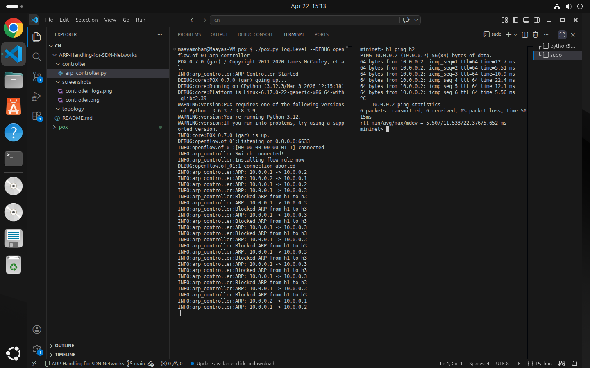
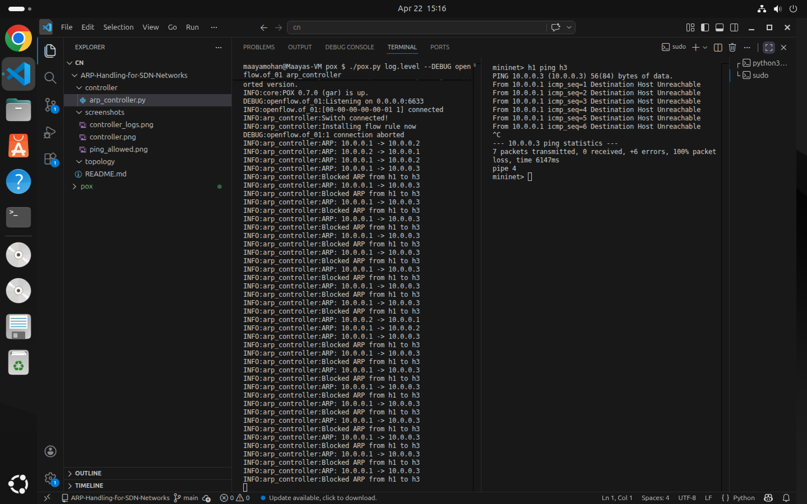

# SDN ARP Handling using POX Controller

## Objective

To implement centralized ARP handling using an SDN controller instead of traditional broadcast-based ARP. The controller intercepts ARP requests, maintains an IP–MAC mapping table, and enforces communication policies.

---

## Tools Used

* Mininet
* POX Controller
* Open vSwitch
* Python

---

## Topology

A single-switch topology with 3 hosts:

* h1 (10.0.0.1)
* h2 (10.0.0.2)
* h3 (10.0.0.3)

---

## Working Principle

* Hosts send ARP requests
* Switch forwards unknown packets to controller
* Controller:

  * Learns IP–MAC mappings
  * Replies to ARP requests directly
  * Blocks communication between h1 and h3
  * Installs flow rules in switch

---

## Controller Logic

* Handle PacketIn events
* Extract ARP packets
* Maintain ARP table
* Generate ARP replies
* Apply blocking rule (h1 → h3)
* Install flow rules

---

## Steps to Run

### 1. Start Controller

```bash
cd ~/pox
./pox.py log.level --DEBUG openflow.of_01 arp_controller
```

---

### 2. Start Mininet

```bash
sudo mn --topo single,3 --controller=remote,ip=127.0.0.1,port=6633
```

---

## Execution & Results

### Controller Startup


---

### Controller Logs


---

### Allowed Communication (h1 → h2)

```bash
h1 ping h2
```



---

### Blocked Communication (h1 → h3)

```bash
h1 ping h3
```



---

## Observations

* ARP requests are handled by controller instead of broadcast
* Communication between h1 and h2 is successful
* Communication between h1 and h3 is blocked
* Flow rules enforce the network policy

---

## Conclusion

This project demonstrates how SDN enables centralized control of network behavior. By handling ARP at the controller level, unnecessary broadcasts are reduced and custom policies (like blocking specific hosts) can be enforced efficiently.

---

## Author

Maaya Mohan